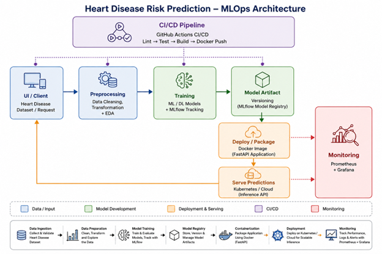

# Heart Disease Risk Prediction — MLOps Pipeline

**MLOps AIMLCZG523 — Assignment 01**
End-to-end pipeline: data acquisition, EDA,
model training with experiment tracking, containerized serving API, CI/CD,
Kubernetes deployment, and monitoring.



## Results 

| Model | Accuracy | Precision | Recall | F1 | ROC-AUC | CV best ROC-AUC |
|---|---|---|---|---|---|---|
| Logistic Regression | 0.885 | 0.839 | 0.929 | 0.881 | **0.965** | 0.898 |
| XGBoost | 0.885 | 0.862 | 0.893 | 0.877 | 0.949 | 0.882 |
| Random Forest | 0.852 | 0.828 | 0.857 | 0.842 | 0.947 | **0.904** |

**Best model selected by test ROC-AUC: Logistic Regression.**

Random Forest had the *highest* cross-validation
score but a *lower* held-out test score than Logistic Regression. With only
~61 test rows, rank order between CV score and test score isn't guaranteed to
agree — that's sampling variance.

## Project structure

```
heart-disease-mlops/
├── data/
│   ├── download_data.py       # 3-tier fallback: ucimlrepo -> direct UCI -> GitHub mirror
│   └── heart_disease.csv      # generated by download_data.py
├── src/
│   ├── preprocessing.py       # ColumnTransformer: impute + scale + one-hot
│   ├── eda.py                 # histograms, correlation heatmap, class balance, missingness, feature relationships
│   ├── train.py                # LR / RF / XGBoost, GridSearchCV, MLflow logging, best-model packaging
│   ├── make_architecture_diagram.py
│   └── api/main.py            # FastAPI: /predict, /health, /metrics
├── tests/
│   ├── test_preprocessing.py  # synthetic-missing-value tests, leakage guard
│   └── test_api.py            # TestClient-based endpoint tests
├── models/                    # model.joblib + metadata.json (generated)
├── mlruns/ + mlflow.db        # MLflow tracking store (generated)
├── reports/figures/           # all PNGs (generated)
├── Dockerfile / .dockerignore
├── .github/workflows/ci-cd.yml
├── k8s/deployment.yaml, service.yaml, helm/heart-disease-api/
└── monitoring/prometheus.yml, docker-compose.yml, grafana_dashboard.json
```

## Setup (clean environment)

```bash
python -m venv venv && source venv/bin/activate      # Windows: venv\Scripts\activate
pip install -r requirements.txt

python data/download_data.py     # -> data/heart_disease.csv
python src/eda.py                # -> reports/figures/*.png
python src/train.py              # -> models/model.joblib, mlruns/, reports/model_comparison.csv
python src/make_architecture_diagram.py

pytest tests/ -v
```

### Data source fallback

`download_data.py` tries three sources in order and prints which one it used:
1. `ucimlrepo` (id=45) — official method, needs outbound access to `archive.ics.uci.edu`.
2. Direct HTTPS pull from UCI's static file host.
3. A GitHub mirror of the identical raw file (last resort).

### View MLflow results

```bash
mlflow ui --backend-store-uri sqlite:///mlflow.db
# open http://localhost:5000 
```

### Run the API locally (no Docker)

```bash
uvicorn src.api.main:app --reload --port 8000
# then: open http://localhost:8000/docs for interactive Swagger UI
```

Example request:
```bash
curl -X POST http://localhost:8000/predict \
  -H "Content-Type: application/json" \
  -d '{"age":63,"sex":1,"cp":1,"trestbps":145,"chol":233,"fbs":1,"restecg":2,"thalach":150,"exang":0,"oldpeak":2.3,"slope":3,"ca":0,"thal":6}'
```

### Docker

```bash
python src/train.py                       
docker build -t heart-disease-api:latest .
docker run -p 8000:8000 heart-disease-api:latest
curl http://localhost:8000/health
```

### Kubernetes (Minikube)

```bash
eval $(minikube docker-env)               
docker build -t heart-disease-api:latest .
kubectl apply -f k8s/deployment.yaml -f k8s/service.yaml
minikube tunnel                           
kubectl get pods,svc
```
**LoadBalancer `EXTERNAL-IP` stays `<pending>` on plain Minikube unless
`minikube tunnel` is running in another terminal.** This is the single most
common "my deployment is broken" false alarm on this assignment — it isn't
broken, the tunnel just isn't up.

### Monitoring (standalone, decoupled from Task 7's deployment choice)

```bash
docker compose -f monitoring/docker-compose.yml up
```
- API: http://localhost:8000
- Prometheus: http://localhost:9090
- Grafana: http://localhost:3000 (admin/admin) → add Prometheus data source
  (`http://prometheus:9090`) → import `monitoring/grafana_dashboard.json`

### CI/CD

`.github/workflows/ci-cd.yml` runs on every push/PR to `main`:
`lint (ruff) -> download data -> train -> EDA -> pytest -> upload model as
artifact -> docker build -> containerized smoke test`. Any failing step stops
the pipeline and shows a red X with that step's log — nothing downstream
silently continues on a broken build.

## Design decisions:

- **Preprocessing lives inside the same `Pipeline` as the classifier** (not
  saved separately), so there is no train/serve skew and no risk of applying
  the scaler/encoder in the wrong order at inference time.
- **Target binarization**: raw `num` (0–4 severity) collapses to `target`
  (0 = no disease, 1 = any severity of disease present), per the assignment's
  "binary target" requirement.
- **MLflow 3.x** deprecated the plain filesystem tracking store used in most
  older tutorials — this project uses a SQLite-backed store
  (`sqlite:///mlflow.db`) instead. 
- **`mlflow.sklearn.log_model` defaults to `skops` serialization** (not
  pickle) as of MLflow 3.x, and blocks numpy/xgboost internal types unless
  explicitly trusted via `skops_trusted_types`.
- Model selection is by **test-set ROC-AUC**, not CV score — see the results
  table above for why that distinction actually mattered on this run.
